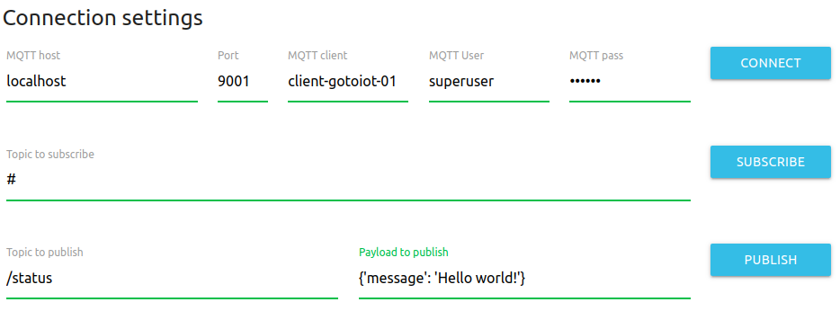
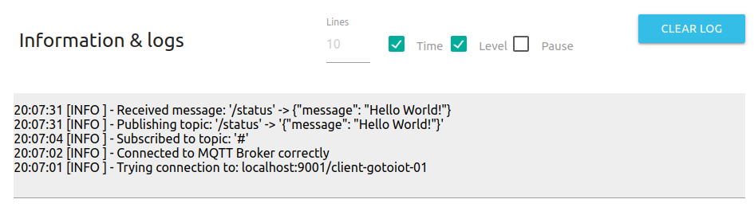

<a href="https://www.gotoiot.com/">
    
</a>

Web MQTT Client
===============

*Ayudaría mucho si apoyaras este proyecto con una ⭐ en Github!*

Este proyecto es una aplicación web que se comunica con un broker `MQTT` através de `WebSockets`. Funciona como un cliente donde se pueden publicar y suscribirse a topics y visualizar los mensajes en tiempo real.

Corre sobre cualquier navegador actual y está desarrollado en `JavaScript`, `HTML` y `CSS`. Los estilos son de `Material Design` y la conexión MQTT con la biblioteca `Paho MQTT`.

## Instalar las dependencias 🔩

<details><summary><b>Mira cómo instalar las dependencias</b></summary><br>

Para correr este proyecto solo necesitas un navegador moderno, aunque es preferible que lo accedas desde un servidor web. Cualquier servidor es válido, aunque si usas [Visual Studio Code](https://code.visualstudio.com/) podes instalar la extensión [Live Server](https://github.com/ritwickdey/vscode-live-server.git), un servidor web para desarrollo muy fácil y práctico de utilizar. 

También va a ser necesario que tengas un broker MQTT al cual conectarte. Si no sabes como hacerlo podes ver nuestro proyecto [Connection MQTT](https://github.com/gotoiot/connection-mqtt), que es un ecosistema MQTT completo.

> Tener el broker no es estrictamente necesario, ya que podes ejecutar la app sin conectarte por MQTT, pero no podrías probar cómo funciona esta aplicación web.

</details>

## Descargar el código 💾

Para descargar el código, lo más conveniente es que realices un `fork` de este proyecto a tu cuenta personal haciendo click en [este link](https://github.com/gotoiot/web-mqtt-client/fork). Una vez que ya tengas el fork a tu cuenta, descargalo con este comando (acordate de poner tu usuario en el link):

```
git clone https://github.com/USER/web-mqtt-client.git
```

> En caso que no tengas una cuenta en Github podes clonar directamente este repo.

## Ejecutar la aplicación 🚀

Para probar la aplicación vas a necesitar accederla desde el navegador.

### Ejecutar la aplicación en el navegador

Si usas Visual Studio Code e instalaste `Live Server`, abrí la carpeta del proyecto en el IDE y hace click derecho sobre el archivo `index.html`. Seleccioná la opción `Open with Live Server` que abrirá automáticamente la aplicación en el navegador. 

Si estas usando otro servidor web accedé a la URL correspondiente; y de manera opcional podés poner el path del archivo desde la barra de búsqueda del navegador (ej: `file://PATH_TO_PROJECT/index.html`).

### Configurar los campos

Una vez que accedas a la app tenes que configurar los campos para conectarte al broker. Muchos de los campos tienen valores precargados para no tener que escribirlos cada vez. Los únicos que no tienen datos cargados son los de usuario y contraseña. 

Si los datos por defecto te sirven, comenzá presionando `CONNECT` y después `SUBSCRIBE` para suscribirte a todos los topics (`#`). Fijate que en la sección de logs aparecen las acciones que vas realizando. Después, una vez que te suscribas a todos los topics presioná el botón `PUBLISH`. Esto va a producir un `echo` del mensaje enviado, y es debido a que estás suscripto a todos los topics.

## Información útil 🔍

En esta sección vas a encontrar información que te va a servir para tener un mayor contexto.

<details><summary><b>Mira todos los detalles</b></summary>

### Realizar pruebas

Si queres hacer una prueba más completa podés abrir en otra pestaña una nueva instancia de esta app, entonces desde una te suscribis a topics y desde la otra publicas, así podes ver la comunicación entre dos clientes utilizando el broker. 

### Configuración de ejemplo

Para que veas la app sin necesidad de ejecutarla, en esta imagen podés ver cómo se cargan los datos para comunicarte con el broker para hacer el echo.



Y en esta otra imagen cómo se van visualizando los logs.



### Configuración de los logs

Para las configuraciones de los logs podés setar el numero de líneas que se muestran con el campo `Lines`. El check `Time` imprime la hora mientras que el check `Level` imprime el nivel de loggeo. Si querés pausar la actualización de mensajes en el log chequeá el campo `Pause`. Por último, si querés borrar los mensajes presioná `CLEAR LOG`.

</details>

## Tecnologías utilizadas 🛠️

<details><summary><b>Mira la lista de tecnologías usadas en el proyecto</b></summary><br>

* [Material Design](https://material.io/design) - Bibliotecas de estilo responsive para aplicaciones web.
* [Paho MQTT](https://www.eclipse.org/paho/) - Biblioteca de JavaScript para MQTT que se ejecuta en el lado del cliente.

</details>

## Contribuir 🖇️

Si estás interesado en el proyecto y te gustaría sumar fuerzas para que siga creciendo y mejorando, podés abrir un hilo de discusión para charlar tus propuestas en [este link](https://github.com/gotoiot/web-mqtt-client/issues/new). Así mismo podés leer el archivo [Contribuir.md](https://github.com/gotoiot/gotoiot-doc/wiki/Contribuir) de nuestra Wiki donde están bien explicados los pasos para que puedas enviarnos pull requests.

## Sobre Goto IoT 📖

Goto IoT es una plataforma que publica material y proyectos de código abierto bien documentados junto a una comunidad libre que colabora y promueve el conocimiento sobre IoT entre sus miembros. Acá podés ver los links más importantes:

* **[Sitio web](https://www.gotoiot.com/):** Donde se publican los artículos y proyectos sobre IoT. 
* **[Github de Goto IoT:](https://github.com/gotoiot)** Donde están alojados los proyectos para descargar y utilizar. 
* **[Comunidad de Goto IoT:](https://groups.google.com/g/gotoiot)** Donde los miembros de la comunidad intercambian información e ideas, realizan consultas, solucionan problemas y comparten novedades.
* **[Twitter de Goto IoT:](https://twitter.com/gotoiot)** Donde se publican las novedades del sitio y temas relacionados con IoT.
* **[Wiki de Goto IoT:](https://github.com/gotoiot/doc/wiki)** Donde hay información de desarrollo complementaria para ampliar el contexto.

## Muestas de agradecimiento 🎁

Si te gustó este proyecto y quisieras apoyarlo, cualquiera de estas acciones estaría más que bien para nosotros:

* Apoyar este proyecto con una ⭐ en Github para llegar a más personas.
* Sumarte a [nuestra comunidad](https://groups.google.com/g/gotoiot) abierta y dejar un feedback sobre qué te pareció el proyecto.
* [Seguirnos en twitter](https://github.com/gotoiot/doc/wiki) y dejar algún comentario o like.
* Compartir este proyecto con otras personas.

## Autores 👥

Las colaboraciones principales fueron realizadas por:

* **[Agustin Bassi](https://github.com/agustinBassi)**: Ideación, puesta en marcha y mantenimiento del proyecto.

También podés mirar todas las personas que han participado en la [lista completa de contribuyentes](https://github.com/web-mqtt-client/contributors).

## Licencia 📄

Este proyecto está bajo Licencia ([MIT](https://choosealicense.com/licenses/mit/)). Podés ver el archivo [LICENSE.md](LICENSE.md) para más detalles sobre el uso de este material.

---

**Copyright © Goto IoT 2021** ⌨️ [**Website**](https://www.gotoiot.com) ⌨️ [**Group**](https://groups.google.com/g/gotoiot) ⌨️ [**Github**](https://www.github.com/gotoiot) ⌨️ [**Twitter**](https://www.twitter.com/gotoiot) ⌨️ [**Wiki**](https://github.com/gotoiot/doc/wiki)
